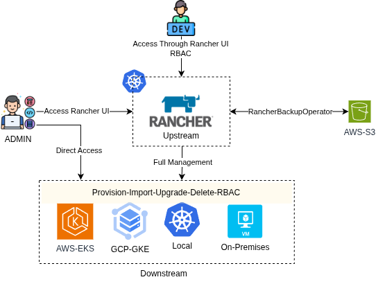
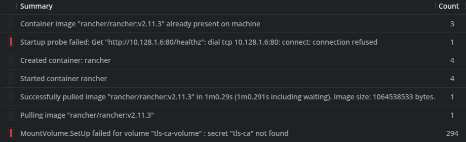
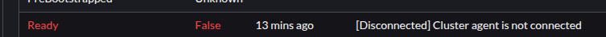

## Rancher - Gerenciamento multi-cluster



### Objetivos:

- 1: Compreender os passos necessários para instalar e gerenciar o Rancher
- 1.1: Script install.sh
- 2: Compreender a arquitetura e como o rancher funciona para executar suas funcionalidades
- 3: Criar, Deletar, Importar, Gerenciar clusters.
- 3.1 [Como fiz: Importar Clusters](./doc-assets/import-cluster/README.md)
- 4: Criar, Deletar, Fornecer, Revogar usuários e acessos.
- 4.1: [Como fiz: Gerenciamento de Usuários](./estudos.md)
- 5: **O Que acontece** com clusters gerenciados ao deletar e restaurar o rancher ?
- 5.1: [Como fiz: Destroy e Restore](./doc-assets/deletar-k8s-upstream/README.md)
- 5.2: [Como fiz: Uninstall Rancher](./doc-assets/uninstall-rancher/deletar.md)
- 6: Documentar todo o processo, buscando **reprodutibilidade**

### Conceitos Base ( Oque é o Rancher):

- O rancher é uma aplicação que permite criar/importar e gerenciar cluster kubernetes de forma simplificada atraves de uma interface web.
- Roda em um cluster Kubernetes, conhecido como local ou upstream.
- Permite criar/deletar clusters em cloud ou On-premisse
- Se comunica através de pods rodando no cluster gerenciador e no cluster gerenciado.
- [Veja a arquitetura do Rancher](https://ranchermanager.docs.rancher.com/reference-guides/rancher-manager-architecture/rancher-server-and-components)

- **Termos**:

  - Upstream: Cluster onde está instalado o rancher e que gerencia os demais, na UI aparece como _local_
  - Downstream: Cluster gerenciado pelo Upstream.

### Repositórios:

[Repositório IAC GCP - Terraform ](https://github.com/Adenilson365/devopslabs01-iac)

### Documentação Oficial e material de apoio:

- [Preparação do cluster ](https://ranchermanager.docs.rancher.com/getting-started/installation-and-upgrade/install-upgrade-on-a-kubernetes-cluster/rancher-on-gke)

- [Instalar Rancher via Helm](https://ranchermanager.docs.rancher.com/getting-started/installation-and-upgrade/install-upgrade-on-a-kubernetes-cluster#install-the-rancher-helm-chart)

- [Cert-manager](https://artifacthub.io/packages/helm/cert-manager/cert-manager)
- [Let's Encrypt](https://letsencrypt.org/getting-started/)

### Configurando comunicação e TLS

- [Documentação Oficial: Modos de TLS](https://ranchermanager.docs.rancher.com/getting-started/installation-and-upgrade/installation-references/tls-settings#agent-tls-enforcement)

- Há 3 modos de TLS
  - strict
    - Recomendado e ativado por default.
    - Obriga a usar TLS na comunicação entre upstream e downstream
    - TLS pode ser fornecido de 3 formas: Rancher ou Let's Ecrypt usando cert-manager, ou criando manualmente os certs.
      - Nesse lab, Instalei fornecendo os certificados.
  - system-store
    - Rancher Agent confia em qualquer certificado criado por uma CA contida no Cacerts.
  - false
    - Não exige TLS
- É possível alterar esses modos usando o CRD setting no cluster Upstream.

```shell
kubectl edit settings agent-tls-mode -o yaml
```

### Comando HELM para instalar com CA própria:

[Documentação Oficial de referência](https://ranchermanager.docs.rancher.com/getting-started/installation-and-upgrade/install-upgrade-on-a-kubernetes-cluster#3-choose-your-ssl-configuration)

```shell
helm upgrade --install rancher rancher-stable/rancher \
  --namespace cattle-system \
  --set hostname=rancher.konzelmann.com.br \
  --set bootstrapPassword=admin \
  --set ingress.tls.source=secret \
  --set ingress.ingressClassName=nginx \
  --set ingress.tls.secretName=konzelmann-wild-tls \
  --set privateCA=true
```

### Para usar PrivateCA:

[Configurar CA ](https://ranchermanager.docs.rancher.com/getting-started/installation-and-upgrade/resources/add-tls-secrets)

- Além dos certificados tls é necessário fornecer a CA, para que o downstream consiga validar a conexão TLS
- Caso não forneça, nos pods rancher no upstream o erro abaixo:
  

- Nesse lab foi usado certificado gerado pela Let's encrypt usando certbot
- Isso gera 4 arquivos: cert.pem chain.pem fullchain.pem privkey.pem
- O certificado TLS é gerado com fullchain.pem e a privkey.pem

```shell
kubectl create secret generic tls-rancher-ingress   --from-file=tls.crt=./fullchain.pem   --from-file=tls.key=./privkey.pem    -n cattle-system

```

- CA
- Crie uma cópia do chain.pem com nome cacerts.pem
- Apartir dessa cópia crie o secret que contém a ca

```shell
kubectl -n cattle-system create secret generic tls-ca --from-file=./chain.pem
```

- ### Alguns erros encontrados durante o processo de instalação:

- **Erro de certificados**
- Ao criar o cluster o erro:
  
- Pods para verificar logs
- Upstream: rancher pods no namespace cattle-system
- Downstream: agent pods no nampespace cattle-system
- Possível validar o cacerts na UI em: globalsettings>showcacerts
- Endpoint onde downstream consulta cacerts: https://<MeuDominio>/v3/settings/cacerts

- **Erro: Versão rancher vs versão do Kubernetes**

```txt
Error: INSTALLATION FAILED: chart requires kubeVersion: < 1.33.0-0 which is incompatible with Kubernetes v1.33.2-gke.1240000
```

> Houve alguns erros menores, principalmente no momento de criar clusters, importar, restaurar backup e conforme foram acontecendo as mensagens são amigáveis e foi possível solucionar.
