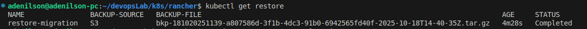
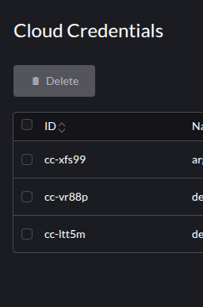
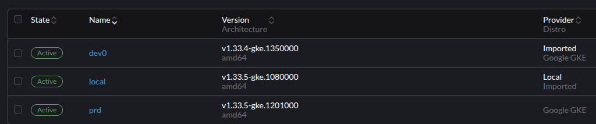

### Delete do Cluster Upstream

- Objetivo: Validar oque acontece com o cluster gerenciado e como recuperar seu controle após o restore do rancher.

### DR:

> Optei por procurar uma estratégia de backup do cluster antes do detroy, uma vez após restaurar o Rancher teria que importar o cluster downstream, o problema é que esse cluster passaria a ser importado e eu perderia o controle de delete dele, ou seja, caso precisasse deletar teria de faze-lo manualmente.

### Rancher Backup com AWS S3

> Como estou restaurando um cluster limpo é necessário realizar um migration, não restore.

[DOC - Rancher backup Operator](https://ranchermanager.docs.rancher.com/how-to-guides/new-user-guides/backup-restore-and-disaster-recovery)

[DOC - Backup Migration](https://ranchermanager.docs.rancher.com/how-to-guides/new-user-guides/backup-restore-and-disaster-recovery/migrate-rancher-to-new-cluster)

- Realizei a instalação do Backup operator diretamente na UI, é um processo relativamente simples.
- **passos**
- 1: Crie 1 secret com as accessKey e SecretKey da ServiceAccount com permissão no Aws S3
- 2: Instale o Operator diretamente na UI em: local>charts>rancher-backup
  - No primeiro link há o passo a passo.
- 3: Crie o backup completo do cluster.
- 4: Destruia o cluster upstream, _Destruir não afeta cluster downstream_
  - A destruição abrupta deixará o downstream _sujo_ com objetos criados pelo upstream
  - No uninstall Rancher esses objetos são limpos.
- 5: Crie um cluster novo
- 6: Recrie o secret de credentials
- 7: Instale o rancher-backup-operator
- 8: Aplique o manifesto do restore e siga os pŕoximos passos após concluir o restore com sucesso:
  
- 9: Instale novamente o Rancher como da primeira vez, precisa ser na mesma versão e parâmetros.
  - Se usou nginx, cert-manager, precisa instalar também.
- 10: Rancher restabelecido ( UI, Clusters Importados, Cluster Gerenciados/criados)

**Para esse backup usei com S3 para rmazenar os backups.**

### Resultados alcançados:

- Os clusters Downstream importados e criados, estavam totalmente disponiveis após o restore
- Usuários também estavam disponíveis, incluindo o admin.
- Foi necessário apenas reinstalar o Rancher e o Nginx
- Nessa instalação não useis cert-manager, pois fiz uma instalação com CA própria.
- Atualizar o registro DNS com o novo IP do Load Balancer do Rancher.

- Credentials foram restauradas:

- Clusters Restaurados:

