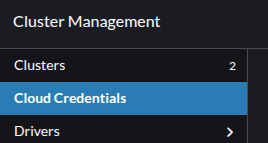
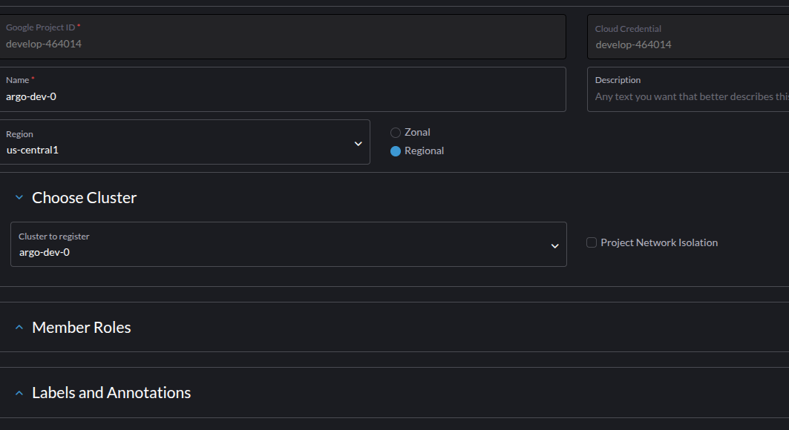
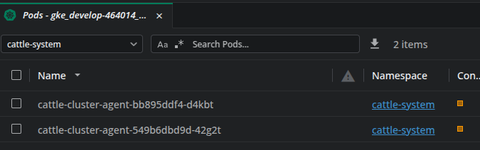
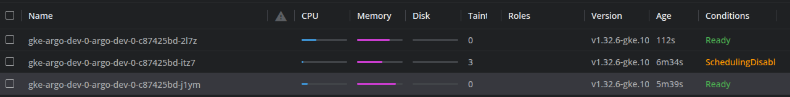
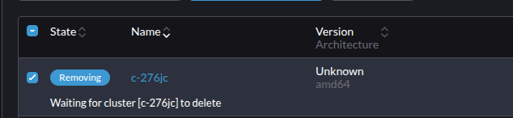

### Importar Cluster criado externamente

### Cloud

- Crie a credential

  

- Selecione a credential e o Cluster, se a credential possuir permissão suficiente o Rancher fará o import.
  
- Criara os agents no cattle-system, assim que os pods do agent ficarem running o cluster passa a ser gerenciado pelo Rancher.
  

- Sempre que há uma troca de nó, o cluster perde temporáriamente a conexão com upstream, mesmo que o pod do agent não esteja nesse nó.
  

- deletar o cluster importado via UI
  

- Vai remover o cluster da gestão do Rancher e limpar os objetos instalados no cluster, incluindo namespaces.
- Precisa validar oque acontece se durante esse processo o cluster perder conexão.
  - Retoma a limpeza ao retornar conexão?
  - È necessário limpar na mão oque restar?
