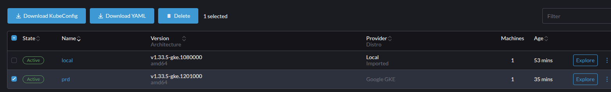
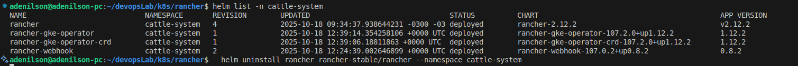
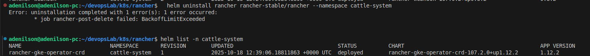
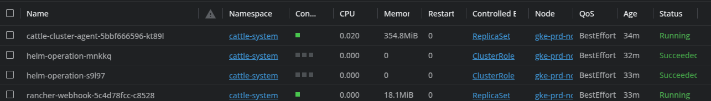
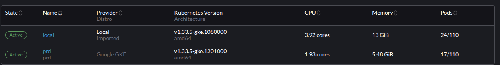

## Uninstall no Helm

- Cluster criado pelo Rancher

- Rodando comando uninstall no helm:

- Removeu os recursos mas ficou um deploy para tras

- No Downstream não removeu os agents, ao desinstalar não executou ações no downstream

- Ao reinstalar o Rancher no Upstream os clusters Downstream voltaram a ser gerenciáveis sem precisar de intervenção.

