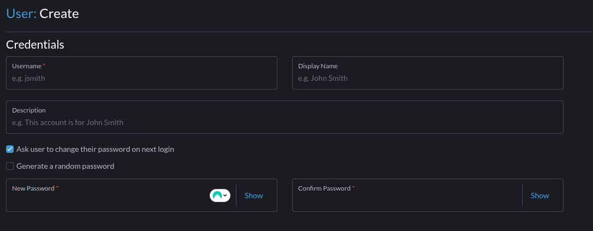
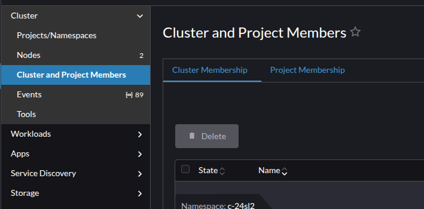
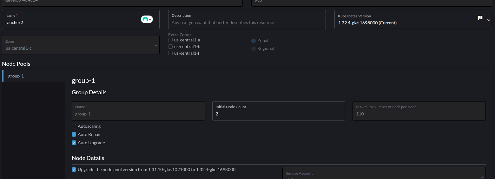

### Criar e Conceder acessos

- Menu: User &authentication>Users>Create

- No primeiro login o usuário deve criar uma nova senha

### Permissões

- Pode ser a nivel de project e a nível de cluster

- A nível de cluster, posso interagir com todos os recursos e projetos no cluster
- A nível de projeto, posso interagir com os kinds criados naquele projeto apenas
  - Verei o cluster, mas apenas kinds pertencentes ao projeto

### Atualização da versão do Kubernetes

Menu: clusterManagement>cluster>editConfig

- Necessário marcar para update da nodepool
- Apenas na atualização de control-plane, troca os pods do kube-system, cria e depois deleta

  - Troca apenas a versão do CP e mantem os WK na versão antiga

- **Update da nodepool**
- Cria o nó na versão nova, e depois faz o taint e a troca

- Primeiro noscheduling, depois noexecute

> Durante a atualização o Rancher perdeu comunicação com o downstream, o agent não conseguiu sincronizar o volume de credentials
>
> > O Processo de atualização continuou durante a perda de comunicação, **A perda durou alguns minutos, até o agent conseguir sincronizar os volumes**
